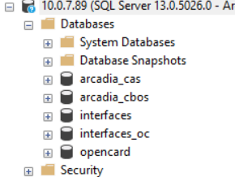
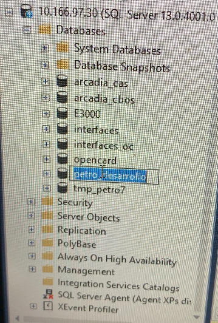

# Datos VPN  
    Usuario: andres.acevedo  
    Contraseña: Nolasco-petro7  
https://187.216.3.187/VPN_Externos  

# Servicenow
    Usuario: alfredo.delacruz  
    Contraeña: 123  
https://iconn.service-now.com/  

# Arcadia 
    Usuario: 999027  
    Contraseña: CosijoezaPetro-7
http://10.0.7.93:81/cbos/liquidationDashboard.html  

# Horario de turnos
    C1: 12:00 am - 06:00AM
    C2: 06:00 am - 2:00 pm
    C3: 02:00 pm - 22:00 pm
    C4: 22:00 pm - 12:00am
    
# Correo
    Usuario: cosijoeza.melchor@petro-7.com.mx  
    Contraseña: Melchor4?  

## CREE
    Usuario: AdminSK 
    Contraseña: SKS.1234
http://10.160.102.6/GestorCRE/Gestion/ReporteVolumenes

# Enlaces
[Share Point](https://7eleven-my.sharepoint.com/personal/ernesto_colunga_petro-7_com_mx/_layouts/15/onedrive.aspx?e=5%3A64fd640a7ff6471f8639c3c701574fc9&FolderCTID=0x01200091C5CDC016AD2949A08FC77BF0A72B4D&id=%2Fpersonal%2Fernesto%5Fcolunga%5Fpetro%2D7%5Fcom%5Fmx%2FDocuments%2FBoveda%5FVolumetricos%2FArchivos%20Volumetricos)
    
[Tipos de incidentes](https://docs.google.com/spreadsheets/d/1ktCojwmFkKj9-H4X3WbY94vDS3p9vvtL98-mJp1ktKE/edit?usp=sharing)

[Lista de asignación JSON](https://docs.google.com/spreadsheets/d/1QoO8hE5sthZ2vkisZcCysOKMcLtpYe73911GJLZdTcc/edit#gid=392901049)

[SharePoint JSON](https://7eleven-my.sharepoint.com/personal/vladimir_herrera_petro-7_com_mx/_layouts/15/onedrive.aspx?id=%2Fpersonal%2Fvladimir%5Fherrera%5Fpetro%2D7%5Fcom%5Fmx%2FDocuments%2FJSON%5FSAT%2FFebrero2021&originalPath=aHR0cHM6Ly83ZWxldmVuLW15LnNoYXJlcG9pbnQuY29tLzpmOi9nL3BlcnNvbmFsL3ZsYWRpbWlyX2hlcnJlcmFfcGV0cm8tN19jb21fbXgvRW1QX2NPZkVmbE5ObUpDeUd4Y3VTV0VCbVE4LWw2MDVGZVdWV01xNWtWckNvQT9ydGltZT1iWEpNUjc3djJFZ)

[DSD Mensajes](http://10.0.7.82:82/interfaceMonitor/arcadiaintegration/processExecutionsOut)

# Cuerpos de correo
## Método de pago
    Buenos días,
    se ha modificado el cambio del método de pago con éxito.
    Saludos.
    Cosijoeza Melchor Nolasco
## Solicitud de mediciones
    Buenos días,

    de su apoyo por favor para enviarnos los prints con las mediciones del día -- de junio (--/06/2021 0:00 am T4) y de hoy inicio del día (--/06/2021 6:00 am T1).

    Nota: Por favor, al contestar el correo, hacerlo a través de la opción responder a todos, para que mis compañeros queden enterados.

    Agradezco su apoyo.
    Cosijoeza Melchor Nolasco.

    

## Ingreso de mediciones
    Buenos días,
    para confirmar que se han ingresado las mediciones de manera manual.
    Muchas gracias por su apoyo, saludos.

    Cosijoeza Melchor Nolasco.  
    Nota: Evitar realizar regularizaciones con mediciones en 0, cuando se tenga este incidente por favor reportarlo antes de regularizar para apoyarlos.
## Para Itza
    Buenas tardes,
    gracias por la información, se han revisado las estaciones y ya cuentan con mediciones en el turno 1.

    Saludos.

    Cosijoeza Melchor Nolasco.
## Diferencia en POS
    Buenos días,
    se ha reenviado operación que no estaba en arcadia y se actualiza pos, deja de haber diferencias.

    Saludos

    Cosijoeza Melchor Nolasco.

# Busqueda en Postgres
~~~~sql
    select numero_oper, sum(importe_pvp) total, clave_emple, codigo_tpv, cod_prod_serv, fecha2, horappv
    from ppv.tpopd
    where fecha1 = '20210331' --año,mes,dia
    and numero_turno = 4
    and cod_prod_serv = '2'
    group by numero_oper, clave_emple, codigo_tpv, cod_prod_serv, fecha2, horappv
    having sum(importe_pvp) <> 0
    order by numero_oper desc;
~~~~
~~~~sql
    update ppv.tpopd set fecha2 = 20210331,horappv=235000 where numero_oper = 499315
~~~~

# ELIMINAR RECEPCIÓN
~~~~sql
select *  from ppv.tprmd001 where numero_recep in (14)
select *  from ppv.tprmc001 where numero_recep in (14)
select *  from ppv.tprmo001 where numero_recep in (14)
~~~~
~~~~sql
DELETE FROM ppv.tprmd001 where numero_recep in (14)
delete from ppv.tprmc001 where numero_recep in (14)
~~~~

# Tarjeta Petro 7
__Enunciado:__ Al cliente se le programo la cantidad de $500.00 y solo se le cargo el monto de $221.81 y salio el ticket con una diferencia de $-278.19.  
__CLIENTE:__ TRANSPORTES GUTS  
__No DE TARJETA:__ 5993  
__MONTO:__ 221.81  

- Esta la devolucion en arcadia de -278 seria buscalar y eliminarla.
- Buscar una operacion igual a 0. Si no está en Arcadia, realiza la comparativa en Excel de la base de datos de la estacion vs las operaciones de las manguera en donde está la diferencia en Arcadia.
- Eliminar de Arcadia la operacion de las que están en 0.
-  Como validacion en la tabla tpopf  hay que revisar si es la misma tarjeta,por lo regular se revisa en la terminación que coincida con la BD y con lo que te mandan en el SN, a través de este query:
    ~~~~sql
    select * from ppv.tpopf where numero_oper =626933--Revisar tarjeta 
    select * from ppv.tpopc where numero_oper = 626933--Revisar estatus ANULADA(hacer update) COMPLETADA(si subio a Arcadia)
    select * from ppv.tpopd where numero_oper = 626933 --Revisar precio

    ~~~~
### Modificar la BD
    ~~~~sql
    update ppv.tpopd set canti =216.3243, importe_pvp = 4721, importe_con_dto =4721,importe_neto =4721, doble4 = 4721  
    where numero_oper = 626933;

    update ppv.tpopf set importe =4721.30 where numero_oper = 626933;

    update ppv.tpopc set importe = 4721.30, referencia = 'COMPLETADA', estado_oper = 6 where numero_oper = 626933;
    ~~~~
- El Update se pone el importe  que le fue suminitrado al cliente.
- Verificar en Arcadia el cambio.

# Conectarme a SQL Server desde LINUX
~~~~sql
    sqlcmd -S 10.0.7.89 -U Arcadia_DBPROD -P 'Arcadia.P7'
~~~~
~~~~sql
    sqlcmd -S 10.0.7.89 -i script.sql -o output.txt -U Arcadia_DBPROD -P 'Arcadia.P7'
~~~~

# Remediaciones volumetricos
~~~~sql
    select numero_oper, importe_pvp, canti, horappv from ppv.tpopd where fecha2=''
    order by numero_oper desc

    select * from ppv.tpopd where numero_oper in()
    select * from ppv.tpopc where numero_oper in()

    update ppv.tpopd set horappv = 201830 where numero_oper in()
    update ppv.tpopc set fecha_emi = '' where numero_oper in()   
~~~~
# Tarjetas tipta
~~~~sql
    INSERT INTO tarjetas.tipta VALUES (default,default,'CREDITOP7','CREDITO PETRO-7','1','','',112,1316,'','N','N','S','',ARRAY[0,0,0,0],'71',ARRAY['','',''],'99','','S','001');

    UPDATE tarjetas.tiptd set tipo_tar='CREDITOP7' where tipo_tar='CREDITO' AND pan_tar='999999';
    
    INSERT INTO tarjetas.tipta VALUES (default,default,'DEBITOP7','DEBITO PETRO-7','1','','',112,1316,'','N','N','S','',ARRAY[0,0,0,0],'71',ARRAY['','',''],'99','','S','001');
    
    INSERT INTO tarjetas.tiptd VALUES (default,default,'DEBITOP7','999998','S');
~~~~

select * from ppv.tprmd001

select * from ppv.tprmd001 td left outer join ppv.tprmo001 tpo on td.numero_recep= tpo.numero_recep 

select *  from ppv.tprmd001 where numero_recep in (470,471,472)

sr.phone.accesorios@gmail.com
Alondra123()
10 abril 2000

contra feis: Alondra123#$

Creo que me resulta más facil escribirtelo, no es necesario que contestes este mensaje.

